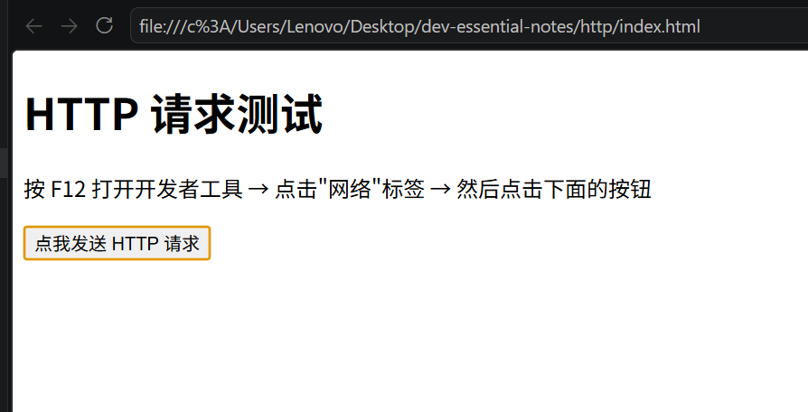
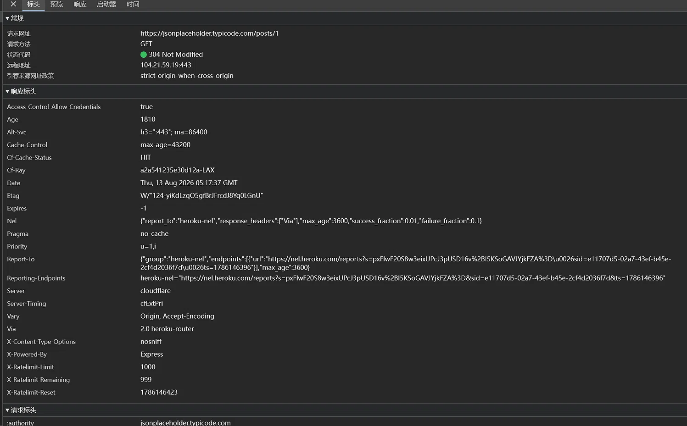
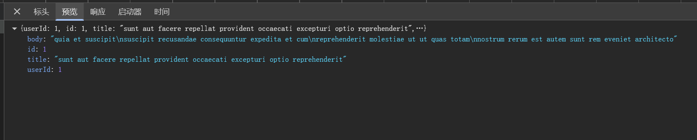
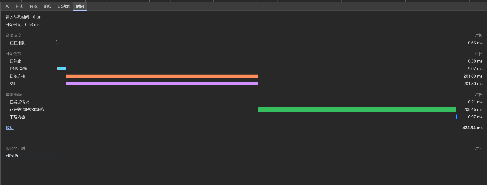
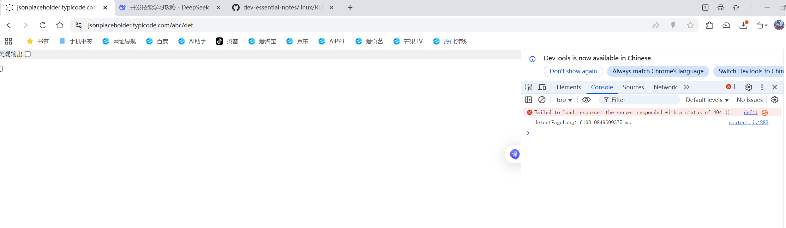
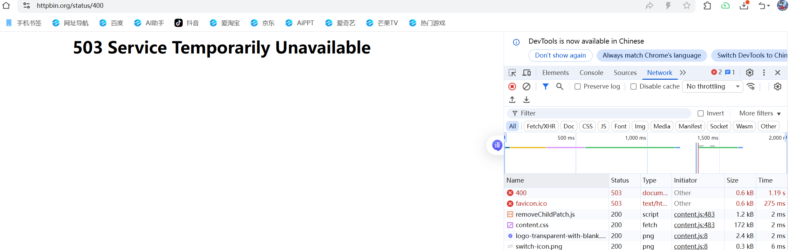
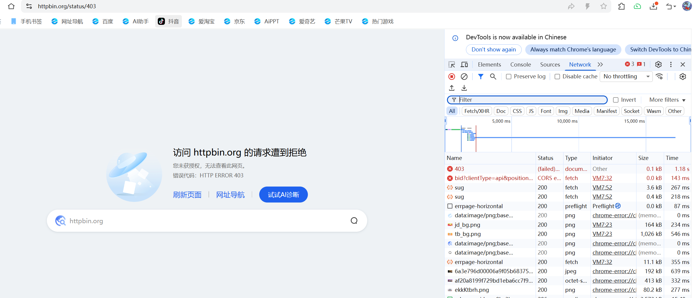
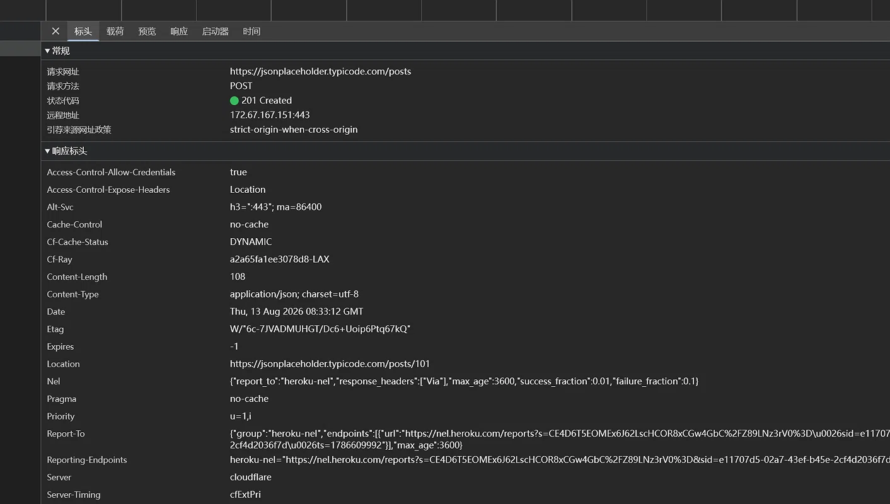
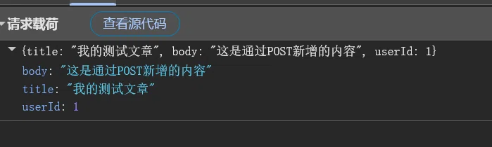
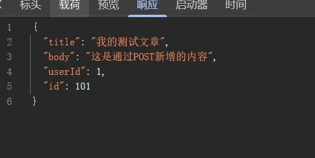

# HTTP 学习笔记

# 日期：2026-08-13

# 知识点
HTTP 是 浏览器（客户端）和服务器（后端）之间沟通的“语言规范”。 
# HTTP 学习笔记

## 1. 常见状态码

| 状态码 | 含义 | 解释 + 实例 |
|--------|------|-------------|
| 200 OK | 成功 | “一切正常，你要的数据回来了。”比如查天气返回温度。 |
| 301 Moved Permanently | 永久重定向 | “网址换了，以后用这个新地址。”比如域名从 old.com 换到 new.com。 |
| 302 Found | 临时重定向 | “这次先去那边。”比如未登录时跳转到登录页。 |
| 304 Not Modified | 资源未修改 | “你本地缓存没过期，直接用旧的。”比如图片没变，不用重新下载。 |
| 400 Bad Request | 请求格式错误 | “你传的参数不对，我读不懂。”比如传了字符串但接口要数字。 |
| 401 Unauthorized | 未登录 | “你没登录，请先登录。” |
| 403 Forbidden | 无权限 | “你登录了，但没资格看这个。”比如普通用户想访问管理员页面。 |
| 404 Not Found | 资源不存在 | “地址写错了，找不到这个页面。” |
| 500 Internal Server Error | 服务器内部错误 | “后端代码炸了（空指针、数组越界）。” |
| 502 Bad Gateway | 网关超时 | “上游服务挂了或者没响应。” |
| 503 Service Unavailable | 服务暂时不可用 | 服务器当前无法处理请求（可能是过载、正在维护、或者临时宕机）。 |

---

## 2. HTTP 方法（增删改查）

| 方法 | 动作 | 举例 | 是否带请求体 |
|------|------|------|-------------|
| GET | 查（获取资源） | `GET /users/1` 获取用户1的信息 | 不带 |
| POST | 增（新建资源） | `POST /users` 创建新用户 | 带 |
| PUT | 全量更新（覆盖） | `PUT /users/1` 完全替换用户1的数据 | 带 |
| PATCH | 部分更新 | `PATCH /users/1` 只修改用户1的邮箱 | 带 |
| DELETE | 删 | `DELETE /users/1` 删除用户1 | 不带 |

---

## 3. GET vs POST 对比

| 对比项 | GET | POST |
|--------|-----|------|
| 数据位置 | URL 里（查询字符串） | 请求体里（body） |
| 安全性 | 参数暴露在地址栏，不安全 | 参数不在地址栏，相对安全 |
| 长度限制 | 有（URL 长度限制） | 无（理论可传大文件） |
| 缓存 | 会被浏览器缓存 | 默认不缓存 |
| 幂等性 | 是（多次请求结果一样） | 否（多次请求可能创建多条数据） |

---

## 4. Cookie vs Token

**为什么需要它们？**  
HTTP 是“无状态”的——每次请求都是独立的，服务器记不住你。为了让你登录一次后，服务器知道你是谁，就有了 Cookie 和 Token 两种方案。

| 对比项 | Cookie | Token |
|--------|--------|-------|
| 存储位置 | 浏览器本地 | 客户端任意（localStorage / 内存） |
| 发送方式 | 浏览器自动携带 | 需手动放在 `Authorization` 头 |
| 跨域支持 | 受限（需配置） | 更好（支持跨域） |
| 适用场景 | 传统 Web 应用 | 前后端分离、移动端、微服务 |
| 可扩展性 | 一般 | 更好（可携带更多自定义信息） |
# 实操1（创建页面观察请求）
1. 创建了一个 HTML 页面，里面有一个按钮。
2. 点击按钮后，浏览器向 `https://jsonplaceholder.typicode.com/posts/1` 发送了一个请求。
3. 在 F12 网络面板中观察到了这次请求的完整过程。

# 观察到了什么
- 请求方法：GET
- 状态码：304
- 服务器返回的数据类型：JSON
-包含 id、title、body 等字段
# 截图
1.网页

2.标头，预览，响应时间

# 实操2（制造不同的状态码）
1. 制造 404 Not Found
操作方法：在浏览器地址栏输入一个不存在的地址。
  
可以观察到页面内容为空，F12网络面板为404
2. 制造 400 Bad Request（请求格式错误）
操作方法：向一个只接受特定格式的接口传错误格式的数据。

3. 制造 403 Forbidden（无权限）
操作方法：访问一个需要特定权限的接口。

# 实操3 创建post请求
1. 
字段	        你看到的值                                           含义
请求网址	https://jsonplaceholder.typicode.com/posts	 你发的地址，告诉服务器在哪个房间存东西
请求方法	POST	                                       你明确说要“新增”数据
状态代码	201 Created	                                 服务器说：“存好了，新的资源已创建”
Location	https://jsonplaceholder.typicode.com/posts/101	服务器告诉你新资源的具体地址（相当于告诉你“你的新书放在第101号书架”）
Content-Type	application/json; charset=utf-8	         服务器返回的是 JSON 格式数据
Server	cloudflare	                                   服务器用了 Cloudflare 代理（说明是真实生产环境）
核心学习点：
201 是 POST 成功时的专属状态码。
Location 响应头是 RESTful 规范里推荐的做法——返回新资源的 URI。
2. 
POST 的数据是放在“请求体”里的，不是 URL 里，这就是 GET 和 POST 最大的区别。
3. 
服务器不仅存了你发来的数据，还在末尾加了一个 id: 101，表示这是它为你这条数据分配的编号。
你下次想获取这条数据，就可以发 GET 请求到 /posts/101

# 完整的 HTTP 请求生命周期
1. 客户端（你的浏览器） 发起一个请求 → 包含方法（POST）、地址（URL）、头（Headers）、体（Body）。
2. 服务器 接收请求 → 验证数据 → 存储到数据库 → 生成编号（101）。
3. 服务器 返回响应 → 状态码（201）、响应头（Location）、响应体（包含完整数据）。
4. 客户端 收到响应 → 弹窗提示成功。
这是一次完整的 “客户端请求 → 服务器处理 → 客户端接收” 流程。
# 实操4 其他 HTTP 方法实测

### PUT（全量更新）
- 请求方法：PUT
- 请求地址：`/posts/1`
- 请求体：必须包含完整资源的所有字段
- 返回：200 OK，完整数据

### PATCH（部分更新）
- 请求方法：PATCH
- 请求地址：`/posts/1`
- 请求体：只包含要修改的字段
- 返回：200 OK，修改后的数据

### DELETE（删除）
- 请求方法：DELETE
- 请求地址：`/posts/1`
- 请求体：通常不需要
- 返回：200 OK 或 204 No Content